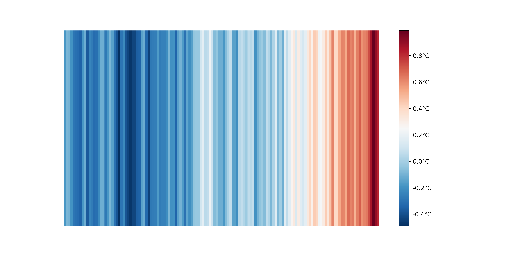

# Warming Stripes
Ressource data et code pour générer des warming stripes

### Ressources
Disposer de données sur des périodes de référence longues pour des graphiques explicites. Ces séries temporelles sont essentiellement disponibles dans le monde scientifique anglo-saxon.
L'ensemble des séries temporelles disponibles représentent des anomalies de température relatives à une période de référence.

#### Data
* [Goddard Space Flight Center , Sciences and Exploration Directorate, Earth Sciences Division](https://data.giss.nasa.gov/gistemp/)
* [NOAA National Center for Environmental Information](https://www.ncdc.noaa.gov/cag/global/time-series/globe)
* [Met Office Hadley Centre observation datasets](https://www.metoffice.gov.uk/hadobs/hadcrut4/)
* [Berkeley Earth](http://berkeleyearth.lbl.gov/)

|Ressources	                 | Période   | Période de référence |
|----------------------------|:----------|:---------------------|
| Goddard Space Flight Center| 1880-2019 | 1901-2000            |
| Met Office                 | 1850-2019 | 1961-1990            |
| NOAA                       | 1880-2019 | 1951-1980            |
| Berkeley Earth             | 1880-2019 | 1951-1980            |

#### Programmation
* [scrape_global_temps](https://github.com/hausfath/scrape_global_temps). Séries de scripts pour télécharger les données de références
* [Fabien Maussion repository](https://github.com/fmaussion/bokeh-stripes). Dépôt d'un glaciologue de l'université d'Innsbruck

#### Un exemple
Réalisé avec le script [warmingStripesV1.py](warmingStripesV1.py) et les données du Goddard Space Center.

#### Visualisations avancées
Utilisation IPython, Bokeh

[Bandes annuelles](html/annual-stripes-700x300.html)
[Bandes mensuelles](html/monthly-stripes-700x300.html)
 
